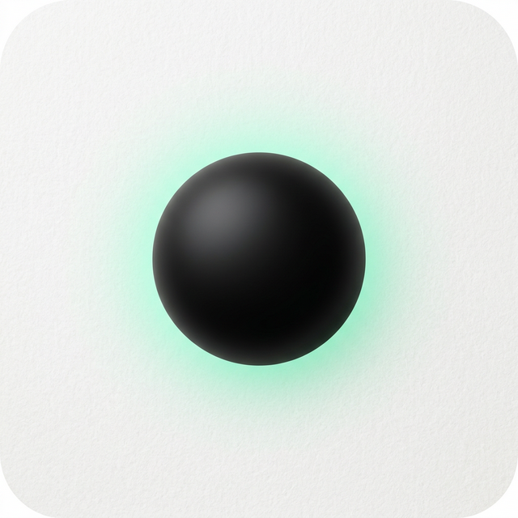

# Remi - Ambient Memory App

<div align="center">
  
  
  **Your second brain for capturing fleeting thoughts**
  
  [](https://github.com/Hansrufys/remi/actions/workflows/build-apk.yml)
  [](LICENSE)
  [](https://www.android.com)
</div>

---

## About

Remi is an ambient memory app that captures your fleeting thoughts before they disappear. Using AI-powered speech healing, it transforms messy voice notes into structured, actionable memories.

### Features

- **Voice-First Input**: Speak naturally, Remi understands
- **Speech Healing**: AI repairs phonetic errors while preserving your tone
- **Smart Extraction**: Automatically categorizes tasks, insights, and patterns
- **Person Memory**: Remembers facts about people you mention
- **Home Screen Widget**: Quick capture without opening the app
- **Pattern Detection**: Discovers behavioral patterns from your thoughts
- **Theme Support**: Light and dark themes

## Download

Download the latest APK from [Releases](https://github.com/Hansrufys/remi/releases)

## Tech Stack

- **Framework**: Flutter 3.19
- **State Management**: Riverpod
- **Navigation**: GoRouter
- **Database**: SQLite + Supabase (optional cloud sync)
- **AI**: Groq API (Llama 3.1)
- **Voice**: Speech-to-Text

## Getting Started

### Prerequisites

- Flutter SDK 3.19+
- Android Studio / VS Code
- Groq API key (free tier available)

### Installation

```bash
# Clone the repository
git clone https://github.com/Hansrufys/remi.git
cd remi

# Install dependencies
flutter pub get

# Run on device
flutter run

# Build APK
flutter build apk --release
```

### Configuration

1. Open the app
2. Go to Settings
3. Enter your Groq API key
4. (Optional) Configure Supabase for cloud sync

## Project Structure

```
lib/
├── core/
│   ├── env/          # Environment configuration
│   ├── providers/    # Riverpod providers
│   ├── router/       # GoRouter configuration
│   ├── theme/        # App theme & colors
│   └── widgets/      # Shared widgets
├── data/
│   ├── models/       # Data models
│   ├── repositories/ # Database operations
│   └── services/     # API services
└── features/
    ├── canvas/       # Main input screen
    ├── memory/       # Memory management
    ├── people/       # Person profiles
    ├── settings/     # App settings
    └── voice/        # Voice input
```

## Architecture

Remi follows a clean architecture pattern:

- **Presentation Layer**: Flutter widgets with Riverpod state management
- **Domain Layer**: Use cases and business logic
- **Data Layer**: Repositories, services, and data sources

## Contributing

Contributions are welcome! Please feel free to submit a Pull Request.

## License

This project is licensed under the MIT License - see the [LICENSE](LICENSE) file for details.

## Acknowledgments

- Design inspired by Apple Notes and Notion
- Built with Flutter and the amazing Flutter community
- AI powered by Groq

---

<div align="center">
  Made with ❤️ by Hansrufys

<!-- Build triggered: $(date) -->
</div>
